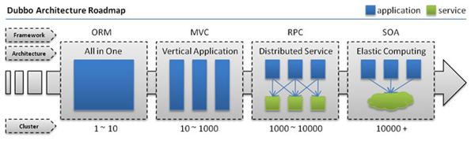

# Dubbo的学习

## 一、基础知识

### 1.分布式基础理论

#### 1.1.什么是分布式系统？

**《分布式系统原理与泛型》定义：**

`“分布式系统是若干独立计算机的集合，这些计算机对于用户来说就像单个相关系统”`

分布式系统（distributed system）是建立在网络上的软件系统。


随着互联网的发展，网站应用的规模不断扩大，常规的垂直应用架构已无法应对，分布式服务架构以及流动计算架构势在必行，亟需**一个治理系统**确保架构有条不紊的演进。

---

#### 1.2.发展演变



- **单一应用架构（ORM—对象关系映射）**

  当网站流量很小时，只需一个应用，将所有功能都部署在一起，以减少部署节点和成本。此时，用于简化增删改查工作量的数据访问框架(ORM)是关键。

  

  **适用于小型网站，小型管理系统，将所有功能都部署到一个功能里，简单易用。**

  **缺点：**

  ​	**1、性能扩展比较难**

  ​    **2、协同开发问题**

  ​    **3、不利于升级维护**

- **垂直应用架构（MVC—模型视图控制器）**

  当访问量逐渐增大，单一应用增加机器带来的加速度越来越小，将应用拆成互不相干的几个应用，以提升效率。此时，用于加速前端页面开发的Web框架(MVC)是关键。

  

  通过切分业务来实现各个模块独立部署，降低了维护和部署的难度，团队各司其职更易管理，性能扩展也更方便，更有针对性。
  **缺点： 公用模块无法重复利用，开发性的浪费**

- **分布式服务架构（RPC—远程过程调用）**

  当垂直应用越来越多，应用之间交互不可避免，将核心业务抽取出来，作为独立的服务，逐渐形成稳定的服务中心，使前端应用能更快速的响应多变的市场需求。此时，用于提高业务复用及整合的**分布式服务框架(RPC)**是关键。

  

  

- **流动计算架构（SOA—面向服务的架构）**

  当服务越来越多，容量的评估，小服务资源的浪费等问题逐渐显现，此时需增加一个调度中心基于访问压力实时管理集群容量，提高集群利用率。此时，用于**提高机器利用率的资源调度和治理中心**<font color=red size=3>(SOA)[ Service Oriented Architecture]</font>是关键。

  

---

#### 1.3.RPC

- **什么叫RPC**

  RPC【Remote Procedure Call】是<font color=red size=3>指远程过程调用，是一种进程间通信方式，他是一种技术的思想，而不是规范</font>。<u>它允许程序调用另一个地址空间（通常是共享网络的另一台机器上）的过程或函数，而不用程序员显式编码这个远程调用的细节</u>。即程序员无论是调用本地的还是远程的函数，本质上编写的调用代码基本相同。

- **RPC基本原理**

  

  ------

  

  **RPC两个核心模块：**<font color=red>通讯，序列化</font>。

  

------

### 2.dubbo核心概念

#### 2.1.简介

**Apache Dubbo (incubating) |ˈdʌbəʊ| 是一款高性能、轻量级的开源Java RPC框架，它提供了三大核心能力**：<font color=red>面向接口的远程方法调用，智能容错和负载均衡，以及服务自动注册和发现</font>。

官网：http://dubbo.apache.org/


#### 2.2.基本概念


**服务提供者（Provider）**：暴露服务的服务提供方，服务提供者在启动时，向注册中心注册自己提供的服务。

**服务消费者（Consumer）**: 调用远程服务的服务消费方，服务消费者在启动时，向注册中心订阅（subscribe）自己所需的服务，服务消费者，从提供者地址列表中，基于软负载均衡算法，选一台提供者进行调用，如果调用失败，再选另一台调用。

**注册中心（Registry）**：注册中心返回服务提供者地址列表给消费者，如果有变更，注册中心将基于长连接推送（notify）变更数据给消费者。

**监控中心（Monitor）**：服务消费者和提供者，在内存中累计调用次数和调用时间，定时每分钟发送一次统计数据到监控中心。

**【调用关系说明】：**

- 服务容器负责启动，加载，运行服务提供者。
- 服务提供者在启动时，向注册中心注册自己提供的服务。
- 服务消费者在启动时，向注册中心订阅自己所需的服务。
- 注册中心返回服务提供者地址列表给消费者，如果有变更，注册中心将基于长连接推送变更数据给消费者。
- 服务消费者，从提供者地址列表中，基于软负载均衡算法，选一台提供者进行调用，如果调用失败，再选另一台调用。
- 服务消费者和提供者，在内存中累计调用次数和调用时间，定时每分钟发送一次统计数据到监控中心。

---

### 3.dubbo环境搭建

#### 3.1.【windows】-安装zookeeper

1. **下载zookeeper**

   网址 https://archive.apache.org/dist/zookeeper/zookeeper-3.4.13/

2. **解压zookeeper**

   解压运行`zkServer.cmd` ，初次运行会报错，没有`zoo.cfg`配置文件

3. **修改zoo.cfg配置文件**

   将conf下的`zoo_sample.cfg`复制一份改名为`zoo.cfg`即可。

   注意几个重要位置：

   ```shell
   dataDir=./  临时数据存储的目录（可写相对路径，比如在bin目录下创建../local-data）
   
   clientPort=2181  zookeeper的端口号
   ```

   修改完成后再次启动zookeeper

4. **使用zkCli.cmd测试**

   ```shell
   ls /：列出zookeeper根下保存的所有节点
   
   create –e /atguigu 123：创建一个atguigu节点，值为123
   
   get /atguigu：获取/atguigu节点的值
   ```


#### 3.2.【windows】-安装dubbo-admin管理控制台

dubbo本身并不是一个服务软件。它其实就是一个jar包能够帮你的java程序连接到zookeeper，并利用zookeeper消费、提供服务。所以你不用在Linux上启动什么dubbo服务。

但是为了让用户更好的管理监控众多的dubbo服务，官方提供了一个可视化的监控程序，不过这个监控即使不装也不影响使用。

1. **下载dubbo-admin**

   https://github.com/apache/incubator-dubbo-ops

   

2. **进入目录，修改dubbo-admin配置**

   修改 `src\main\resources\application.properties` 指定zookeeper地址

   

3. **打包dubbo-admin**

   ```shell
   mvn clean package -Dmaven.test.skip=true
   ```

4. **运行dubbo-admin**

   ```shell
   java -jar dubbo-admin-0.0.1-SNAPSHOT.jar
   ```

   **注意：【有可能控制台看着启动了，但是网页打不开，需要在控制台按下ctrl+c即可】**

   默认使用`root/root` 登陆


#### 3.3.【Linux】-安装zookeeper

##### 1、安装jdk

1. **下载jdk**

   http://www.oracle.com/technetwork/java/javase/downloads/jdk8-downloads-2133151.html

   

   **不要使用wget命令获取jdk链接，这是默认不同意，导致下载来的jdk压缩内容错误**

2. **上传到服务器并解压**

   

3. **设置环境变量**

   `/usr/local/java/jdk1.8.0_171`

   

   **文件末尾加入下面配置**

   ```shell
   export JAVA_HOME=/usr/local/java/jdk1.8.0_171
   export JRE_HOME=${JAVA_HOME}/jre
   export CLASSPATH=.:${JAVA_HOME}/lib:${JRE_HOME}/lib
   export PATH=${JAVA_HOME}/bin:$PATH
   ```

   

4. **使环境变量生效&测试JDK**

   

##### 2、安装zookeeper

1. **下载zookeeper**

   网址 https://archive.apache.org/dist/zookeeper/zookeeper-3.4.11/

   wget https://archive.apache.org/dist/zookeeper/zookeeper-3.4.11/zookeeper-3.4.11.tar.gz 

2. **解压**

   

3. **移动到指定位置并改名为zookeeper**

   

   

##### 3、开机启动zookeeper

1. **复制如下脚本**

   ```bash
   #!/bin/bash
   #chkconfig:2345 20 90
   #description:zookeeper
   #processname:zookeeper
   ZK_PATH=/usr/local/zookeeper
   export JAVA_HOME=/usr/local/java/jdk1.8.0_171
   case $1 in
            start) sh  $ZK_PATH/bin/zkServer.sh start;;
            stop)  sh  $ZK_PATH/bin/zkServer.sh stop;;
            status) sh  $ZK_PATH/bin/zkServer.sh status;;
            restart) sh $ZK_PATH/bin/zkServer.sh restart;;
            *)  echo "require start|stop|status|restart"  ;;
   esac
   
   ```

   

2. **把脚本注册为Service**

   

3. **增加权限**

   

##### 4、配置zookeeper

1. **初始化zookeeper配置文件**

   拷贝`/usr/local/zookeeper/conf/zoo_sample.cfg`   
   到同一个目录下改个名字叫`zoo.cfg`

   

2. **启动zookeeper**

   


#### 3.4.【Linux】-安装dubbo-admin管理控制台

##### 1、安装Tomcat8（旧版dubbo-admin是war，新版是jar不需要安装Tomcat）

1. **下载Tomcat8并解压**

   https://tomcat.apache.org/download-80.cgi

   wget http://mirrors.shu.edu.cn/apache/tomcat/tomcat-8/v8.5.32/bin/apache-tomcat-8.5.32.tar.gz

2. **解压移动到指定位置**

   

3. **开机启动tomcat8**

   

   **复制如下脚本**

   ```bash
   #!/bin/bash
   #chkconfig:2345 21 90
   #description:apache-tomcat-8
   #processname:apache-tomcat-8
   CATALANA_HOME=/opt/apache-tomcat-8.5.32
   export JAVA_HOME=/opt/java/jdk1.8.0_171
   case $1 in
   start)
       echo "Starting Tomcat..."  
       $CATALANA_HOME/bin/startup.sh
       ;;
   
   stop)
       echo "Stopping Tomcat..."  
       $CATALANA_HOME/bin/shutdown.sh
       ;;
   
   restart)
       echo "Stopping Tomcat..."  
       $CATALANA_HOME/bin/shutdown.sh
       sleep 2
       echo  
       echo "Starting Tomcat..."  
       $CATALANA_HOME/bin/startup.sh
       ;;
   *)
       echo "Usage: tomcat {start|stop|restart}"  
       ;; esac
   
   ```

4. **注册服务&添加权限**

   

   

5. **启动服务&访问tomcat测试**

   

   


##### 2、安装dubbo-admin

dubbo本身并不是一个服务软件。它其实就是一个jar包能够帮你的java程序连接到zookeeper，并利用zookeeper消费、提供服务。所以你不用在Linux上启动什么dubbo服务。

但是为了让用户更好的管理监控众多的dubbo服务，官方提供了一个可视化的监控程序，不过这个监控即使不装也不影响使用。

1. **下载dubbo-admin**

   https://github.com/apache/incubator-dubbo-ops

   

2. **进入目录，修改`dubbo-admin`配置**

   修改 `src\main\resources\application.properties` 指定zookeeper地址

   

3. **打包dubbo-admin**

   ```shell
   mvn clean package -Dmaven.test.skip=true 
   ```

4. **运行dubbo-admin**

   ```shell
   java -jar dubbo-admin-0.0.1-SNAPSHOT.jar
   ```

   **注意：【有可能控制台看着启动了，但是网页打不开，需要在控制台按下ctrl+c即可】**

   默认使用`root/root` 登陆

   

---

### 4.dubbo-helloworld

#### 4.1.提出需求

某个电商系统，订单服务需要调用用户服务获取某个用户的所有地址；
我们现在 需要创建两个服务模块进行测试 

| 模块                | 功能           |
| ------------------- | -------------- |
| 订单服务web模块     | 创建订单等     |
| 用户服务service模块 | 查询用户地址等 |

测试预期结果：
				订单服务web模块在A服务器，用户服务模块在B服务器，A可以远程调用B的功能。


#### 4.2.工程架构

**根据 dubbo《服务化最佳实践》**

##### 1.分包

建议将**服务接口，服务模型，服务异常**等均放在 API 包中，因为服务模型及异常也是 API 的一部分，同时，这样做也符合分包原则：重用发布等价原则(REP)，共同重用原则(CRP)。
   	如果需要，也可以考虑在 API 包中放置一份 `spring` 的引用配置，这样使用方，只需在 `spring` 加载过程中引用此配置即可，配置建议放在模块的包目录下，以免冲突，如：`com/alibaba/china/xxx/dubbo-reference.xml`。

##### 2.粒度

服务接口尽可能大粒度，**每个服务方法应代表一个功能，而不是某功能的一个步骤**，否则将面临分布式事务问题，Dubbo 暂未提供分布式事务支持。
   **服务接口建议以业务场景为单位划分，并对相近业务做抽象，防止接口数量爆炸**。
   **不建议使用过于抽象的通用接口**，如：Map query(Map)，这样的接口没有明确语义，会给后期维护带来不便。


#### 4.3.创建模块

##### 1.gmall-interface：公共接口层（model，service，exception…）

   作用：定义公共接口，也可以导入公共依赖

   ```java
1、Bean模型
public class UserAddress implements Serializable{
    private Integer id;
    private String userAddress;
    private String userId;
    private String consignee;
    private String phoneNum;
    private String isDefault;
}
   ```

   ```java
2、Service接口
public interface UserService{
   public List<UserAddress> getUserAddressList(String userId)
}
   ```

   

##### 2.gmall-user：用户模块（对用户接口的实现）

   ```xml
1、pom.xml
<dependencies>
    <dependency>
        <groupId>com.atguigu.dubbo</groupId>
        <artifactId>gmall-interface</artifactId>
        <version>0.0.1-SNAPSHOT</version>
    </dependency>
</dependencies>
   ```

   ```java
2、Service
public class UserServiceImpl implements UserService {
    @Override
    public List<UserAddress> getUserAddressList(String userId) {
        // TODO Auto-generated method stub
        return userAddressDao.getUserAddressById(userId);
    }
}
   ```

##### 3.gmall-order-web：订单模块（调用用户模块）

```xml
1、pom.xml
<dependencies>
  	<dependency>
  		<groupId>com.atguigu.dubbo</groupId>
  		<artifactId>gmall-interface</artifactId>
  		<version>0.0.1-SNAPSHOT</version>
  	</dependency>
</dependencies>
```

```java
2、测试
public class OrderService {
	UserService userService;
	/**
	 * 初始化订单，查询用户的所有地址并返回
	 * @param userId
	 * @return
	 */
	public List<UserAddress> initOrder(String userId){
		return userService.getUserAddressList(userId);
	}
}

```

现在这样是无法进行调用的。我们`gmall-order-web`引入了`gmall-interface`，但是`interface`的实现是`gmall-user`，我们并没有引入，而且实际他可能还在别的服务器中。


#### 4.4.使用dubbo改造

##### 1.改造gmall-user作为服务提供者

1、**引入dubbo（pom.xml）**

```xml
<!-- 引入dubbo -->
<dependency>
    <groupId>com.alibaba</groupId>
    <artifactId>dubbo</artifactId>
    <version>2.6.2</version>
</dependency>
<!-- 由于我们使用zookeeper作为注册中心，所以需要操作zookeeper dubbo2.6以前的版本引入zkclient操作zookeeper dubbo 2.6及以后的版本引入curator操作zookeeper下面两个zk客户端根据dubbo版本2选1即可
-->
    
<dependency>
    <groupId>com.101tec</groupId>
    <artifactId>zkclient</artifactId>
    <version>0.10</version>
</dependency>
    
<!-- curator-framework -->
<dependency>
    <groupId>org.apache.curator</groupId>
    <artifactId>curator-framework</artifactId>
    <version>2.12.0</version>
</dependency>
```

2、**配置提供者（provider.xml）**

```xml
<!--1、指定当前服务/应用的名字（同样的服务名字相同，不要和别的服务同名）-->
<dubbo:application name="user-service-provider"></dubbo:application>

<!--2、指定注册中心的位置-->
<!--<dubbo:registry address="zookeeper://127.0.0.1:2181"></dubbo:registry>-->
<dubbo:registry  protocol="zookeeper" address="127.0.0.1:2181"></dubbo:registry>

<!--3、指定通信规则（通信协议？通信端口）-->
<dubbo:protocol name="dubbo" port="20880"></dubbo:protocol>

<!--4、暴露服务 ref:指向服务真正的实现对象-->
<dubbo:service interface="git.olin.gmall.service.UserService" ref="userServiceImpl"></dubbo:service>

<!--服务的实现-->
<bean id="userServiceImpl" class="git.olin.gmall.service.impl.UserServiceImpl"></bean>
```

3、**启动服务（MainApplication.java）**

```java
public static void main(String[] args) throws IOException {
    ClassPathXmlApplicationContext ioc = new 	        ClassPathXmlApplicationContext("provider.xml");
    ioc.start();
    // 为了不让程序终止，阻塞读取一个字符
    System.in.read();
}
```


##### 2.改造gmall-order-web作为服务消费者

1、**引入dubbo（pom.xml）**

```xml
<!-- 引入dubbo -->
<dependency>
    <groupId>com.alibaba</groupId>
    <artifactId>dubbo</artifactId>
    <version>2.6.2</version>
</dependency>
<!-- 由于我们使用zookeeper作为注册中心，所以需要操作zookeeper dubbo2.6以前的版本引入zkclient操作zookeeper dubbo 2.6及以后的版本引入curator操作zookeeper下面两个zk客户端根据dubbo版本2选1即可
-->
    
<dependency>
    <groupId>com.101tec</groupId>
    <artifactId>zkclient</artifactId>
    <version>0.10</version>
</dependency>
    
<!-- curator-framework -->
<dependency>
    <groupId>org.apache.curator</groupId>
    <artifactId>curator-framework</artifactId>
    <version>2.12.0</version>
</dependency>
```

2、**配置提供者（consumer.xml）**

```xml
<!--包扫描-->
<context:component-scan base-package="git.olin.gmall.service.impl"></context:component-scan>

<doubbo:application name="order-service-consumer"></doubbo:application>

<doubbo:registry address="zookeeper://127.0.0.1:2181"></doubbo:registry>

<!--声明需要调用的远程服务接口，生成远程服务代理-->
<dubbo:reference interface="git.olin.gmall.service.UserService" id="userService"></dubbo:reference>
```


##### 3.测试调用（MainApplication.java）

```java
public static void main(String[] args) throws IOException {
    ClassPathXmlApplicationContext applicationContext = new ClassPathXmlApplicationContext("consumer.xml");
    OrderService orderService = applicationContext.getBean(OrderService.class);
    orderService.initOrder("1");
    System.out.println("调用完成！");
    // 为了不让程序终止，阻塞读取一个字符
    System.in.read();
}
```

访问`gmall-order-web`的`initOrder`请求，会调用`UserService`获取用户地址；
调用成功。说明我们`order`已经可以调用远程的`UserService`了；


------

### 5.监控中心

#### 5.1.dubbo-admin

图形化的服务管理页面；安装时需要指定注册中心地址，即可从注册中心中获取到所有的提供者/消费者进行配置管理

#### 5.2.dubbo-monitor-simple

简单的监控中心；

##### 1、安装

###### 1.下载 dubbo-ops

[https://github.com/apache/incubator-dubbo-ops](https://github.com/apache/incubator-dubbo-ops)

###### 2.修改配置指定注册中心地址

进入 `dubbo-monitor-simple\src\main\resources\conf`
		修改 `dubbo.properties`文件


###### 3.打包dubbo-monitor-simple

```shell
mvn clean package -Dmaven.test.skip=true
```

###### 4.解压 tar.gz 文件，并运行`start.bat`


如果缺少`servlet-api`，自行导入`servlet-api`再访问监控中心

###### 5.启动访问8080


---

##### 2、监控中心配置（monitor）

```xml
所有服务配置（提供者与消费者的配置文件中）连接监控中心，进行监控统计，下面两种任选其一：
<!--监控中心协议，如果为protocol="registry"，表示从注册中心发现监控中心地址，否则直连监控中心 -->
<dubbo:monitor protocol="registry"></dubbo:monitor>
<!--直连监控中心服务器地址-->
<doubbo:monitor address="127.0.0.1:7070"></doubbo:monitor>
```

`Simple-Monitor` 挂掉不会影响到 `Consumer` 和 `Provider` 之间的调用，所以用于生产环境不会有风险。

`Simple-Monitor` 采用磁盘存储统计信息，请注意安装机器的磁盘限制，如果要集群，建议用`mount`共享磁盘。

---

### 6.与SpringBoot整合的三种方式

#### 方式一

**①导入dubbo-starter；**

**②在application.properties配置属性；**

**③使用@Service【暴露服务】使用@Reference【引用服务】。**

##### 1、引入spring-boot-starter以及dubbo和curator的依赖（使用idea创建一般自带启动器依赖项）

```xml
<dependency>
    <groupId>com.alibaba.boot</groupId>
    <artifactId>dubbo-spring-boot-starter</artifactId>
    <version>0.2.0</version>
</dependency>
```

注意starter版本适配：


##### 2、配置application.properties

`pom.xml:`(提供者与消费者都需要导入如下依赖)

```xml
<!--引入依赖公共的API接口-->
<dependency>
    <groupId>git.olin</groupId>
    <artifactId>boot-dubbo-api</artifactId>
    <version>1.0-SNAPSHOT</version>
</dependency>
<!--引入dubbo-->
<!-- https://mvnrepository.com/artifact/com.alibaba/dubbo -->
<dependency>
    <groupId>com.alibaba</groupId>
    <artifactId>dubbo</artifactId>
    <version>2.6.2</version>
</dependency>

<!--注册中心使用的是zookeeper，引入操作zookeeper的客户端（curator）-->
<dependency>
    <groupId>org.apache.curator</groupId>
    <artifactId>curator-framework</artifactId>
    <version>2.12.0</version>
</dependency>
```

`API-interface`:（服务提供者与消费者都需要依赖的项目，实体类与接口定义）

```
com.xxx.project_name
					-|bean
					-|service
```

###### 1.服务提供者

`application.properties`:

```properties
dubbo.application.name=boot-user-service-provider
dubbo.registry.address=127.0.0.1:2181
dubbo.registry.protocol=zookeeper
dubbo.protocol.name=dubbo
dubbo.protocol.port=20880
dubbo.monitor.address=127.0.0.1:7070
#dubbo.scan.base-package=git.olin.gmall 此配置可要可无
#application.name就是服务名，不能跟别的dubbo提供端重复
#registry.protocol 是指定注册中心协议
#registry.address 是注册中心的地址加端口号
#protocol.name 是分布式固定是dubbo,不要改。
#base-package  注解方式要扫描的包
```

`XXXServiceImpl`:

```java
@Service // 暴露服务
@Component
public class XXXServiceImpl implements XXXService {
	...
}
```

`BootXXXServiceProviderApplication:`

```java
@EnableDubbo // 开启基于注解的dubbo功能
@SpringBootApplication
public class BootXXXServiceProviderApplication {
	public static void main(String[] args) throws IOException {
		SpringApplication.run(BootXXXServiceProviderApplication.class, args);
		System.out.println("服务已启动！");
		System.in.read();
	}
}
```

###### 2.服务消费者

`application.properties`:

```properties
# 打开监控中心（simple-monitor）的web页面会默认占用tomcat端口8080，因此需要修改端口号
server.port=8081
dubbo.application.name=boot-order-web-consumer
dubbo.registry.address=zookeeper://127.0.0.1:2181
dubbo.monitor.protocol=registry
```

`XXXController`:

```java
@Controller     // 控制器注解
public class XXXController {
    @Autowired  // 自动装配
    XXXService xxxService;

    @ResponseBody // 返回json类型的数据
    @RequestMapping("/initOrder") // 请求RESTful类型的网址
    // @RequestParam("uid")请求RESTful类型的网址所带参数，
    // 如：http://localhost:8081/initOrder?uid=2
    public List<UserAddress> initXXX(@RequestParam("uid") String userId){
        return xxxService.initOrder(userId);
    }
}
```

`XXXServiceImpl`:

```java
@Service // 暴露服务
public class XXXServiceImpl implements XXXService {
    @Reference // 引用服务提供者暴露的服务，相当于@Autowired
    UserService userService;

    public List<UserAddress> initXXX(String userId) {
        System.out.println("用户id:" + userId);
        // 1、查询用户的收货地址
        List<UserAddress> addressList = userService.getUserAddressList(userId);
       return addressList;
    }
}
```

`BootXXXWebConsumerApplication`:

```java
@EnableDubbo
@SpringBootApplication
public class BootXXXWebConsumerApplication {
	public static void main(String[] args) throws IOException {
		SpringApplication.run(BootXXXWebConsumerApplication.class, args);
		System.out.println("远程调用已完成！");
		System.in.read();
	}
}
```

【**注意**】

dubbo注解：

`@Service`、`@Reference`

【**如果没有在配置中写`dubbo.scan.base-package`,还需要使用`@EnableDubbo`注解**】

---

#### 方式二

**①保留dubbo-xml配置文件；**

**②导入dubbo-starter；**

**③使用@ImportResource导入dubbo的配置文件即可。**

##### 服务提供者

```java
@ImportResource(locations = "classpath:dubbo-provider.xml") // 方式二
@SpringBootApplication
public class BootUserServiceProviderApplication {

    public static void main(String[] args) throws IOException {
        SpringApplication.run(BootUserServiceProviderApplication.class, args);
        System.out.println("服务已启动！");
        System.in.read();
    }
}
```

---

#### 方式三

**①使用注解API的方式；**

**②将每一组件手动创建到容器中；**

**③让dubbo来扫描其他的组件。**

API 属性与配置项一对一，各属性含义，请参见：[配置参考手册](http://dubbo.apache.org/zh-cn/docs/user/references/xml/introduction.html)，比如：`ApplicationConfig.setName("xxx")` 对应 ``

##### 服务提供者

```java
import org.apache.dubbo.rpc.config.ApplicationConfig;
import org.apache.dubbo.rpc.config.RegistryConfig;
import org.apache.dubbo.rpc.config.ProviderConfig;
import org.apache.dubbo.rpc.config.ServiceConfig;
import com.xxx.XxxService;
import com.xxx.XxxServiceImpl;
 
// 服务实现
XxxService xxxService = new XxxServiceImpl();
 
// 当前应用配置
ApplicationConfig application = new ApplicationConfig();
application.setName("xxx");
 
// 连接注册中心配置
RegistryConfig registry = new RegistryConfig();
registry.setAddress("10.20.130.230:9090");
registry.setUsername("aaa");
registry.setPassword("bbb");
 
// 服务提供者协议配置
ProtocolConfig protocol = new ProtocolConfig();
protocol.setName("dubbo");
protocol.setPort(12345);
protocol.setThreads(200);
 
// 注意：ServiceConfig为重对象，内部封装了与注册中心的连接，以及开启服务端口
 
// 服务提供者暴露服务配置
ServiceConfig<XxxService> service = new ServiceConfig<XxxService>(); // 此实例很重，封装了与注册中心的连接，请自行缓存，否则可能造成内存和连接泄漏
service.setApplication(application);
service.setRegistry(registry); // 多个注册中心可以用setRegistries()
service.setProtocol(protocol); // 多个协议可以用setProtocols()
service.setInterface(XxxService.class);
service.setRef(xxxService);
service.setVersion("1.0.0");
 
// 暴露及注册服务
service.export();
```

##### 服务消费者

```java
import org.apache.dubbo.rpc.config.ApplicationConfig;
import org.apache.dubbo.rpc.config.RegistryConfig;
import org.apache.dubbo.rpc.config.ConsumerConfig;
import org.apache.dubbo.rpc.config.ReferenceConfig;
import com.xxx.XxxService;
 
// 当前应用配置
ApplicationConfig application = new ApplicationConfig();
application.setName("yyy");
 
// 连接注册中心配置
RegistryConfig registry = new RegistryConfig();
registry.setAddress("10.20.130.230:9090");
registry.setUsername("aaa");
registry.setPassword("bbb");
 
// 注意：ReferenceConfig为重对象，内部封装了与注册中心的连接，以及与服务提供方的连接
 
// 引用远程服务
ReferenceConfig<XxxService> reference = new ReferenceConfig<XxxService>(); // 此实例很重，封装了与注册中心的连接以及与提供者的连接，请自行缓存，否则可能造成内存和连接泄漏
reference.setApplication(application);
reference.setRegistry(registry); // 多个注册中心可以用setRegistries()
reference.setInterface(XxxService.class);
reference.setVersion("1.0.0");
 
// 和本地bean一样使用xxxService
XxxService xxxService = reference.get(); // 注意：此代理对象内部封装了所有通讯细节，对象较重，请缓存复用
```

##### 特殊场景

下面只列出不同的地方，其它参见上面的写法

###### 方法级设置

```java
...
 
// 方法级配置
List<MethodConfig> methods = new ArrayList<MethodConfig>();
MethodConfig method = new MethodConfig();
method.setName("createXxx");
method.setTimeout(10000);
method.setRetries(0);
methods.add(method);
 
// 引用远程服务
ReferenceConfig<XxxService> reference = new ReferenceConfig<XxxService>(); // 此实例很重，封装了与注册中心的连接以及与提供者的连接，请自行缓存，否则可能造成内存和连接泄漏
...
reference.setMethods(methods); // 设置方法级配置
 
...
```

###### 点对点直连

```java
...
 
ReferenceConfig<XxxService> reference = new ReferenceConfig<XxxService>(); // 此实例很重，封装了与注册中心的连接以及与提供者的连接，请自行缓存，否则可能造成内存和连接泄漏
// 如果点对点直连，可以用reference.setUrl()指定目标地址，设置url后将绕过注册中心，
// 其中，协议对应provider.setProtocol()的值，端口对应provider.setPort()的值，
// 路径对应service.setPath()的值，如果未设置path，缺省path为接口名
reference.setUrl("dubbo://10.20.130.230:20880/com.xxx.XxxService"); 
 
...
```

---

## 二、dubbo配置

相关配置使用详见：dubbo官网的示例 http://dubbo.apache.org/zh-cn/docs/user/demos/。

### 1.配置原则


- JVM 启动 -D 参数优先，这样可以使用户在部署和启动时进行参数重写，比如在启动时需改变协议的端口。
- XML 次之，如果在 XML 中有配置，则 `dubbo.properties` 中的相应配置项无效。
- Properties 最后，相当于缺省值，只有 XML 没有配置时，`dubbo.properties` 的相应配置项才会生效，通常用于共享公共配置，比如应用名。

---

### 2.启动时检查

Dubbo 缺省会在启动时检查依赖的服务是否可用，不可用时会抛出异常，阻止 Spring 初始化完成，以便上线时，能及早发现问题，默认 `check="true"`。

可以通过 `check="false"` 关闭检查，比如，测试时，有些服务不关心，或者出现了循环依赖，必须有一方先启动。

另外，如果你的 Spring 容器是懒加载的，或者通过 API 编程延迟引用服务，请关闭 check，否则服务临时不可用时，会抛出异常，拿到 null 引用，如果 `check="false"`，总是会返回引用，当服务恢复时，能自动连上。

#### 通过 spring 配置文件

关闭某个服务的启动时检查 (没有提供者时报错)：

```xml
<dubbo:reference interface="git.olin.UserService" check="false" />
```

关闭所有服务的启动时检查 (没有提供者时报错)：

```xml
<dubbo:consumer check="false" />
```

关闭注册中心启动时检查 (注册订阅失败时报错)：

```xml
<dubbo:registry check="false" />
```

#### 通过 `dubbo.properties`

```properties
dubbo.reference.com.foo.BarService.check=false
dubbo.reference.check=false
dubbo.consumer.check=false
dubbo.registry.check=false
```

#### 配置的含义

`dubbo.reference.check=false`，强制改变所有 reference 的 check 值，就算配置中有声明，也会被覆盖。

`dubbo.consumer.check=false`，是设置 check 的缺省值，如果配置中有显式的声明，如：``，不会受影响。

`dubbo.registry.check=false`，前面两个都是指订阅成功，但提供者列表是否为空是否报错，如果注册订阅失败时，也允许启动，需使用此选项，将在后台定时重试。

---

### 3.超时配置覆盖关系

#### 超时

```xml
<!--timeout="0"超时 默认是1000ms-->
<dubbo:reference interface="git.olin.gmall.service.UserService" id="userService" 	 	timeout="5000"></dubbo:reference>
```

以 timeout 为例，下图显示了配置的查找顺序，其它 retries, loadbalance, actives 等类似：

- 方法级优先，接口级次之，全局配置再次之。
- 如果级别一样，则消费方优先，提供方次之。

其中，服务提供方配置，通过 URL 经由注册中心传递给消费方。


（建议由服务提供方设置超时，因为一个方法需要执行多长时间，服务提供方更清楚，如果一个消费方同时引用多个服务，就不需要关心每个服务的超时设置）。

------

### 4.重试次数

失败自动切换，当出现失败，重试其它服务器，但重试会带来更长延迟。可通过 retries="2" 来设置重试次数(不含第一次)。

```xml
<!--retries="":重试次数，不包含第一次调用，0代表不重试-->
<!--幂等(设置重试次数【数据库：查询、删除、修改】)、非幂等(不能设置重试次数【数据库：新增】)-->
重试次数配置如下：
[provider.xml]
<dubbo:service retries="2" />
或
[consumer.xml]
<dubbo:reference retries="2" />
或
<dubbo:reference>
    <dubbo:method name="method_name" retries="2" />
</dubbo:reference>
```

---

### 5.多版本

当一个接口实现，出现不兼容升级时，可以用版本号过渡，版本号不同的服务相互间不引用。

可以按照以下的步骤进行版本迁移：

- 在低压力时间段，先升级一半提供者为新版本

- 再将所有消费者升级为新版本

- 然后将剩下的一半提供者升级为新版本

```xml
老版本服务提供者配置：
<dubbo:service interface="com.foo.BarService" version="1.0.0" />

新版本服务提供者配置：
<dubbo:service interface="com.foo.BarService" version="2.0.0" />

老版本服务消费者配置：
<dubbo:reference id="barService" interface="com.foo.BarService" version="1.0.0" />

新版本服务消费者配置：
<dubbo:reference id="barService" interface="com.foo.BarService" version="2.0.0" />

如果不需要区分版本，可以按照以下的方式配置：
<dubbo:reference id="barService" interface="com.foo.BarService" version="*" />
```

---

### 6.本地存根

远程服务后，客户端通常只剩下接口，而实现全在服务器端，但提供方有些时候想在客户端也执行部分逻辑，比如：做 ThreadLocal 缓存，提前验证参数，调用失败后伪造容错数据等等，此时就需要在 API 中带上 Stub，客户端生成 Proxy 实例，会把 Proxy 通过构造函数传给 Stub，然后把 Stub 暴露给用户，Stub 可以决定要不要去调 Proxy。


在 spring 配置文件中按以下方式配置：

```xml
<dubbo:service interface="com.foo.BarService" stub="true" />
```

或

```xml
<dubbo:service interface="com.foo.BarService" stub="com.foo.BarServiceStub" />
```

提供 Stub 的实现：

```java
package com.foo;
public class BarServiceStub implements BarService {
    private final BarService barService;
    
    // 构造函数传入真正的远程代理对象
    public BarServiceStub(BarService barService){
        this.barService = barService;
    }
 
    public String sayHello(String name) {
        // 此代码在客户端执行, 你可以在客户端做ThreadLocal本地缓存，或预先验证参数是否合法，等等
        try {
            return barService.sayHello(name);
        } catch (Exception e) {
            // 你可以容错，可以做任何AOP拦截事项
            return "容错数据";
        }
    }
}
```

1. Stub 必须有可传入 Proxy 的构造函数。
2. 在 interface 旁边放一个 Stub 实现，它实现 BarService 接口，并有一个传入远程 BarService 实例的构造函数 

---

## 三、高可用

### 1.zookeeper宕机与dubbo直连

现象：zookeeper注册中心宕机，还可以消费dubbo暴露的服务。

原因：

**健壮性**

- 监控中心宕掉不影响使用，只是丢失部分采样数据
- 数据库宕掉后，注册中心仍能通过缓存提供服务列表查询，但不能注册新服务
- 注册中心对等集群，任意一台宕掉后，将自动切换到另一台
- <font color=red>注册中心全部宕掉后，服务提供者和服务消费者仍能通过本地缓存通讯</font>
- 服务提供者无状态，任意一台宕掉后，不影响使用
- 服务提供者全部宕掉后，服务消费者应用将无法使用，并无限次重连等待服务提供者恢复

**高可用：通过设计，减少系统不能提供服务的时间；**

---

### 2.集群下dubbo负载均衡配置

- 在集群负载均衡时，Dubbo 提供了多种均衡策略，缺省为 `random` 随机调用。

  可以自行扩展负载均衡策略，参见：[负载均衡扩展](http://dubbo.apache.org/zh-cn/docs/dev/impls/load-balance.html)

  #### 负载均衡策略

  ##### Random LoadBalance

  - **随机**，按权重设置随机概率。
  - 在一个截面上碰撞的概率高，但调用量越大分布越均匀，而且按概率使用权重后也比较均匀，有利于动态调整提供者权重。

  ##### RoundRobin LoadBalance

  - **轮询**，按公约后的权重设置轮询比率。
  - 存在慢的提供者累积请求的问题，比如：第二台机器很慢，但没挂，当请求调到第二台时就卡在那，久而久之，所有请求都卡在调到第二台上。

  ##### LeastActive LoadBalance

  - **最少活跃调用数**，相同活跃数的随机，活跃数指调用前后计数差。
  - 使慢的提供者收到更少请求，因为越慢的提供者的调用前后计数差会越大。

  ##### ConsistentHash LoadBalance

  - **一致性 Hash**，相同参数的请求总是发到同一提供者。
  - 当某一台提供者挂时，原本发往该提供者的请求，基于虚拟节点，平摊到其它提供者，不会引起剧烈变动。
  - 算法参见：http://en.wikipedia.org/wiki/Consistent_hashing
  - 缺省只对第一个参数 Hash，如果要修改，请配置 ``
  - 缺省用 160 份虚拟节点，如果要修改，请配置 ``

  #### 配置

  ##### 服务端服务级别

  ```xml
  <dubbo:service interface="..." loadbalance="roundrobin" />
  ```

  ##### 客户端服务级别

  ```xml
  <dubbo:reference interface="..." loadbalance="roundrobin" />
  ```

  ##### 服务端方法级别

  ```xml
  <dubbo:service interface="...">
      <dubbo:method name="..." loadbalance="roundrobin"/>
  </dubbo:service>
  ```

  ##### 客户端方法级别

  ```xml
  <dubbo:reference interface="...">
      <dubbo:method name="..." loadbalance="roundrobin"/>
  </dubbo:reference>
  ```

---

### 3.整合hystrix，集群容错与降级处理

#### 整合`hystrix`

Hystrix 旨在通过控制那些访问远程系统、服务和第三方库的节点，从而对延迟和故障提供更强大的容错能力。Hystrix具备拥有回退机制和断路器功能的线程和信号隔离，请求缓存和请求打包，以及监控和配置等功能。

- **配置`spring-cloud-starter-netflix-hystrix`**

  spring boot官方提供了对`hystrix`的集成，直接在服务提供者与消费者pom.xml里加入如下依赖：

  ```xml
  <!--配置spring-cloud-starter-netflix-hystrix容错依赖-->
  <dependency>
      <groupId>org.springframework.cloud</groupId>
      <artifactId>spring-cloud-starter-netflix-hystrix</artifactId>
      <version>2.2.2.RELEASE</version>
  </dependency>
  ```

  然后在`BootXXX[Provider | Consumer]Application`类上增加`@EnableHystrix`来启用`hystrix starter`：

  ```java
  @EnableHystrix // 开启服务容错
  @SpringBootApplication
  public class BootXXXProviderApplication {
  
      public static void main(String[] args) throws IOException {
          SpringApplication.run(BootXXXProviderApplication.class, args);
          System.out.println("服务已启动！");
          System.in.read();
      }
  }
  ```

- **配置Provider端**

  在`Dubbo`的`Provider`上增加`@HystrixCommand`配置，这样子调用就会经过Hystrix代理。

  ```java
  @Service(version = "1.0.0")
  public class HelloServiceImpl implements HelloService {
      @HystrixCommand(commandProperties = {
       @HystrixProperty(name = "circuitBreaker.requestVolumeThreshold", value = "10"),
       @HystrixProperty(name = "execution.isolation.thread.timeoutInMilliseconds", value = "2000") })
      // 或者简写成@HystrixCommand()
      @Override
      public String sayHello(String name) {
          // System.out.println("async provider received: " + name);
          // return "annotation: hello, " + name;
          throw new RuntimeException("Exception to show hystrix enabled.");
      }
  }
  ```

- **配置Consumer端**

  对于`Consumer`端，则可以增加一层`method`调用，并在`method`上配置`@HystrixCommand`。当调用出错时，会走到`fallbackMethod = "reliable"`的调用那里。

  ```java
  @Reference(version = "1.0.0")
  private HelloService demoService;
  
  @HystrixCommand(fallbackMethod = "reliable")
  public String doSayHello(String name) {
      return demoService.sayHello(name);
  }
  // 服务器容错之后调用此方法
  public String reliable(String name) {
      return "hystrix fallback value";
  }
  ```

---

#### 集群容错

在集群调用失败时，Dubbo 提供了多种容错方案，缺省为 `failover` 重试。


各节点关系：

- 这里的 `Invoker` 是 `Provider` 的一个可调用 `Service` 的抽象，`Invoker` 封装了 `Provider` 地址及 `Service` 接口信息
- `Directory` 代表多个 `Invoker`，可以把它看成 `List` ，但与 `List` 不同的是，它的值可能是动态变化的，比如注册中心推送变更
- `Cluster` 将 `Directory` 中的多个 `Invoker` 伪装成一个 `Invoker`，对上层透明，伪装过程包含了容错逻辑，调用失败后，重试另一个
- `Router` 负责从多个 `Invoker` 中按路由规则选出子集，比如读写分离，应用隔离等
- `LoadBalance` 负责从多个 `Invoker` 中选出具体的一个用于本次调用，选的过程包含了负载均衡算法，调用失败后，需要重选

##### 集群容错模式

可以自行扩展集群容错策略，参见：[集群扩展](http://dubbo.apache.org/zh-cn/docs/dev/impls/cluster.html)

###### Failover Cluster

失败自动切换，当出现失败，重试其它服务器 [[1\]](http://dubbo.apache.org/zh-cn/docs/user/demos/fault-tolerent-strategy.html#fn1)。通常用于读操作，但重试会带来更长延迟。可通过 `retries="2"` 来设置重试次数(不含第一次)。

重试次数配置如下：

```xml
<dubbo:service retries="2" />
```

或

```xml
<dubbo:reference retries="2" />
```

或

```xml
<dubbo:reference>
    <dubbo:method name="findFoo" retries="2" />
</dubbo:reference>
```

###### Failfast Cluster

快速失败，只发起一次调用，失败立即报错。通常用于非幂等性的写操作，比如新增记录。

###### Failsafe Cluster

失败安全，出现异常时，直接忽略。通常用于写入审计日志等操作。

###### Failback Cluster

失败自动恢复，后台记录失败请求，定时重发。通常用于消息通知操作。

###### Forking Cluster

并行调用多个服务器，只要一个成功即返回。通常用于实时性要求较高的读操作，但需要浪费更多服务资源。可通过 `forks="2"` 来设置最大并行数。

###### Broadcast Cluster

广播调用所有提供者，逐个调用，任意一台报错则报错 [[2\]](http://dubbo.apache.org/zh-cn/docs/user/demos/fault-tolerent-strategy.html#fn2)。通常用于通知所有提供者更新缓存或日志等本地资源信息。

##### 集群模式配置

按照以下示例在服务提供方和消费方配置集群模式

```xml
<dubbo:service cluster="failsafe" />
```

或

```xml
<dubbo:reference cluster="failsafe" />
```

---

#### 服务降级

**什么是服务降级？**

**当服务器压力剧增的情况下，根据实际业务情况及流量，对一些服务和页面有策略的不处理或换种简单的方式处理，从而释放服务器资源以保证核心交易正常运作或高效运作。**

可以通过服务降级功能临时屏蔽某个出错的非关键服务，并定义降级后的返回策略。

向注册中心写入动态配置覆盖规则：

```java
RegistryFactory registryFactory = ExtensionLoader.getExtensionLoader(RegistryFactory.class).getAdaptiveExtension();
Registry registry = registryFactory.getRegistry(URL.valueOf("zookeeper://10.20.153.10:2181"));
registry.register(URL.valueOf("override://0.0.0.0/com.foo.BarService?category=configurators&dynamic=false&application=foo&mock=force:return+null"));
```

其中：

- `mock=force:return+null` 表示消费方对该服务的方法调用都直接返回 null 值，不发起远程调用。用来屏蔽不重要服务不可用时对调用方的影响。
- 还可以改为 `mock=fail:return+null` 表示消费方对该服务的方法调用在失败后，再返回 null 值，不抛异常。用来容忍不重要服务不稳定时对调用方的影响。

---

## 四、Dubbo原理

### 1.RPC原理


一次完整的RPC调用流程（同步调用，异步另说）如下： 

1. **服务消费方（client）调用以本地调用方式调用服务；** 

2. client stub接收到调用后负责将方法、参数等组装成能够进行网络传输的消息体； 

3. client stub找到服务地址，并将消息发送到服务端； 

4. server stub收到消息后进行解码； 

5. server stub根据解码结果调用本地的服务； 

6. 本地服务执行并将结果返回给server stub； 

7. server stub将返回结果打包成消息并发送至消费方； 

8. client stub接收到消息，并进行解码； 

9. **服务消费方得到最终结果。**

RPC框架的目标就是要2~8这些步骤都封装起来，这些细节对用户来说是透明的，不可见的。

---

### 2.netty通信原理

Netty是一个异步事件驱动的网络应用程序框架， 用于快速开发可维护的高性能协议服务器和客户端。它极大地简化并简化了TCP和UDP套接字服务器等网络编程。

**BIO：(Blocking IO)**


**NIO (Non-Blocking IO)**


**Selector 一般称 为选择器 ，也可以翻译为 多路复用器，Connect（连接就绪）、Accept（接受就绪）、Read（读就绪）、Write（写就绪）**

Netty基本原理：


---

### 3.Dubbo原理

#### 3.1.dubbo原理	-框架设计 


- **config 配置层**：对外配置接口，以 `ServiceConfig`, `ReferenceConfig` 为中心，可以直接初始化配置类，也可以通过 `spring` 解析配置生成配置类
- **proxy 服务代理层**：服务接口透明代理，生成服务的客户端 `Stub` 和服务器端 `Skeleton`, 以 `ServiceProxy` 为中心，扩展接口为 `ProxyFactory`
- **registry 注册中心层**：封装服务地址的注册与发现，以服务 URL 为中心，扩展接口为 `RegistryFactory`, `Registry`, `RegistryService`
- **cluster 路由层**：封装多个提供者的路由及负载均衡，并桥接注册中心，以 `Invoker` 为中心，扩展接口为 `Cluster`, `Directory`, `Router`, `LoadBalance`
- **monitor 监控层**：RPC 调用次数和调用时间监控，以 `Statistics` 为中心，扩展接口为 `MonitorFactory`, `Monitor`, `MonitorService`
- **protocol 远程调用层**：封装 RPC 调用，以 `Invocation`, `Result` 为中心，扩展接口为 `Protocol`, `Invoker`, `Exporter`
- **exchange 信息交换层**：封装请求响应模式，同步转异步，以 `Request`, `Response` 为中心，扩展接口为 `Exchanger`, `ExchangeChannel`, `ExchangeClient`, `ExchangeServer`
- **transport 网络传输层**：抽象 `mina` 和 `netty` 为统一接口，以 `Message` 为中心，扩展接口为 `Channel`, `Transporter`, `Client`, `Server`, `Codec`
- **serialize 数据序列化层**：可复用的一些工具，扩展接口为 `Serialization`, `ObjectInput`, `ObjectOutput`, `ThreadPool`

---

#### 3.2.dubbo原理	-启动解析、加载配置信息 

1. 首先进入idea中，使用快捷键【shift+shift】进行全局搜索，输入`BeanDefinitionParse`，注意是个接口，这个接口主要是来解析配置文件（Spring、SpringBoot、Dubbo等等）的。如下图：


2. 完成上一步骤之后，使用快捷键【Ctrl+H】查看该接口或者类继承关系，调出继承树，如上图的右侧面板，找到`DubboBeanDefinitionParse`，这是实现类，主要是用来解析dubbo的配置文件，如下图：


3. 完成上述步骤之后，找到步骤2中的实现类`DubboBeanDefinitionParse`的带参构造方法，打上断点，然后在服务提供者的主程序中进行断点调试，即可查看相关配置信息。如下图：


4. 完成上述步骤之后，断点调试会进入`DubboNamespaceHandler`，在该实现类中有`init`方法完成dubbo相关配置的初始化。如下图：


---

#### 3.3.dubbo原理	-服务暴露


---

#### 3.4.dubbo原理	-服务引用


---

#### 3.5.dubbo原理	-服务调用


---

## 五、参考

[尚硅谷dubbo视频](http://www.atguigu.com/download.shtml#Dubbo)